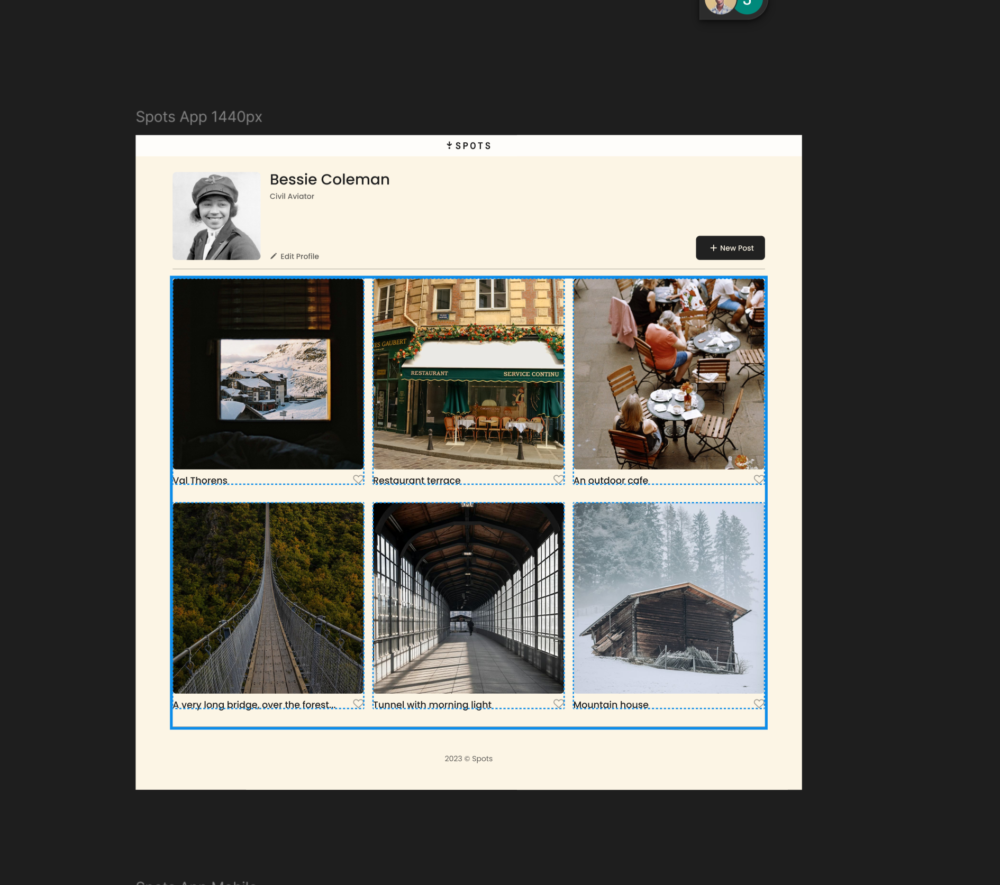

# Insta-Spot

### AltSchool Circle 01 – Assignment 02

A static photo-sharing web page inspired by Instagram and Pinterest. 
 
Built using *HTML* and *CSS*, this project focuses on collaboration, responsive layout design, and clean UI structure.

---

## 🔍 Project Overview

This is the *second semester* for AltSchool Tinyuka Frontend track and this is a group assignment to give the students real live experience working together as a team. 
 
#### The task: 

Build a *static image-sharing profile page* with a user section, gallery cards, and simple interactions — no JavaScript required.

---

## 🛠 Tech Stack

- HTML5  
- CSS3 (Flexbox + Grid)

---

## 🚀 Live Link

👉 [View Insta-Spot Live](https://insta-spot-circle-01.netlify.app/)

---

## 👥 Team

We are a group of *10 students* from AltSchool Circle 01.  
Each member contributed to layout design, structure, responsiveness, and styling.

---

## 📁 Features

- 🧑‍💼 User profile section with name, title, and profile image  
- ➕ “New Post” button (static)  
- 🖼 Responsive image grid layout  
- ❤ Hoverable like icons  
- 📱 Mobile-friendly design  

---

## 🧪 Status

✅ *Complete*  
❌ No JavaScript – static-only interaction

---

## 💻 How to Run

You can run this project locally with just a browser:

bash
# Clone the repo
git clone https://github.com/Reuben-10/altschool-circle1-insta-spot-assignment-02.git
# Navigate into the folder
cd insta-spot

# Open in your browser
open index.html
`

> No installation or server setup required.

---

## 📸 Screenshots

| Desktop View                 | Mobile View                            |
| ---------------------------- | -------------------------------------- |
|  |  |

---

## 📄 License

Free to use and modify for educational purposes.

---

## 💡 Acknowledgements

Special thanks to AltSchool Africa and Mr. Oluwasetemi Ojo - The Tinyuka Frontend track instructor.

---